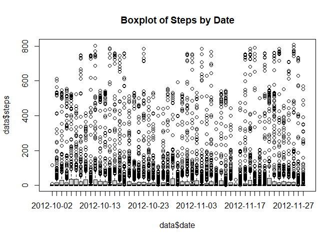
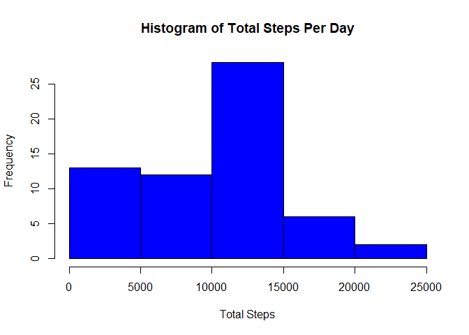
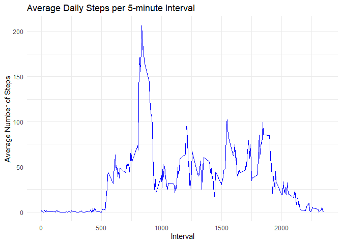
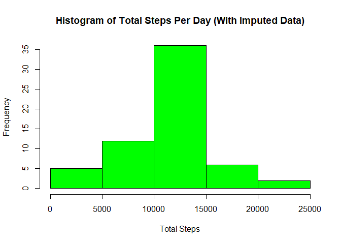
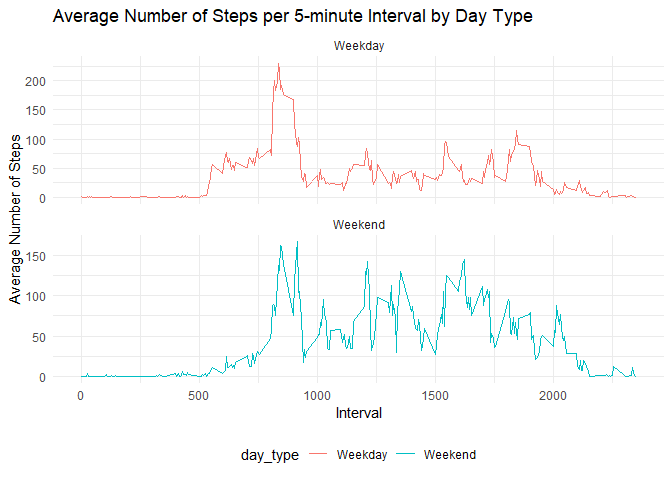

## Loading and preprocessing the data


```r
# Load the Data
data <- read.csv("./activity.csv")
head(data)
```

```
##   steps       date interval
## 1    NA 2012-10-01        0
## 2    NA 2012-10-01        5
## 3    NA 2012-10-01       10
## 4    NA 2012-10-01       15
## 5    NA 2012-10-01       20
## 6    NA 2012-10-01       25
```

```r
# Inspect the Data Structure
str(data)
```

```
## 'data.frame':	17568 obs. of  3 variables:
##  $ steps   : int  NA NA NA NA NA NA NA NA NA NA ...
##  $ date    : chr  "2012-10-01" "2012-10-01" "2012-10-01" "2012-10-01" ...
##  $ interval: int  0 5 10 15 20 25 30 35 40 45 ...
```

```r
summary(data)
```

```
##      steps            date              interval     
##  Min.   :  0.00   Length:17568       Min.   :   0.0  
##  1st Qu.:  0.00   Class :character   1st Qu.: 588.8  
##  Median :  0.00   Mode  :character   Median :1177.5  
##  Mean   : 37.38                      Mean   :1177.5  
##  3rd Qu.: 12.00                      3rd Qu.:1766.2  
##  Max.   :806.00                      Max.   :2355.0  
##  NA's   :2304
```

```r
# Check for Missing Values
missing_steps <- sum(is.na(data$steps))
print(paste("Total missing values in 'steps':", missing_steps))
```

```
## [1] "Total missing values in 'steps': 2304"
```

```r
# Data Transformation
data$date <- as.Date(data$date, format="%Y-%m-%d")

# Initial Exploration of Missing Values
table_missing_dates <- table(is.na(data$steps), data$date)
print("Table of missing values by date:")
```

```
## [1] "Table of missing values by date:"
```

```r
# Data Integrity Check
boxplot(data$steps ~ data$date, main="Boxplot of Steps by Date")
```

<!-- -->

```r
invalid_intervals <- any(data$interval < 0 | data$interval > 2355)
print(paste("Are there any invalid intervals? ", invalid_intervals))
```

```
## [1] "Are there any invalid intervals?  FALSE"
```

```r
## What is mean total number of steps taken per day?
```

```r
library(dplyr)
```

```
## 
## Attaching package: 'dplyr'
```

```
## The following objects are masked from 'package:stats':
## 
##     filter, lag
```

```
## The following objects are masked from 'package:base':
## 
##     intersect, setdiff, setequal, union
```

```r
# Group data by date and calculate total steps per day
daily_steps <- data %>%
  group_by(date) %>%
  summarize(total_steps = sum(steps, na.rm = TRUE))

# Histogram of total steps per day
hist(daily_steps$total_steps, 
     main = "Histogram of Total Steps Per Day", 
     xlab = "Total Steps", 
     col = "blue")
```

<!-- -->

```r
# Calculate and report the mean and median
mean_steps <- mean(daily_steps$total_steps)
median_steps <- median(daily_steps$total_steps)

print(paste("Mean of total steps per day:", mean_steps))
```

```
## [1] "Mean of total steps per day: 9354.22950819672"
```

```r
print(paste("Median of total steps per day:", median_steps))
```

```
## [1] "Median of total steps per day: 10395"
```

```r
## What is the average daily activity pattern?
```

```r
library(dplyr)
library(ggplot2)

# Calculate average steps for each interval
average_interval_steps <- data %>%
  group_by(interval) %>%
  summarize(average_steps = mean(steps, na.rm = TRUE))

# Time Series Plot of the Average Number of Steps per Interval
ggplot(average_interval_steps, aes(x = interval, y = average_steps)) +
  geom_line(color = "blue") +
  labs(title = "Average Daily Steps per 5-minute Interval",
       x = "Interval",
       y = "Average Number of Steps") +
  theme_minimal()
```

<!-- -->

```r
# Identify the interval with the maximum average steps
max_interval <- average_interval_steps[which.max(average_interval_steps$average_steps), ]
print(paste("The 5-minute interval with the maximum average number of steps is:", max_interval$interval))
```

```
## [1] "The 5-minute interval with the maximum average number of steps is: 835"
```

```r
## Imputing missing values
```

```r
library(dplyr)

# Total number of missing values
total_missing_values <- sum(is.na(data$steps))
print(paste("Total number of missing values in the dataset:", total_missing_values))
```

```
## [1] "Total number of missing values in the dataset: 2304"
```

```r
# Strategy for filling missing values: Use the mean for 5-minute interval
imputed_data <- data
for (i in unique(data$interval)) {
  imputed_data$steps[is.na(imputed_data$steps) & imputed_data$interval == i] <- 
    mean(data$steps[data$interval == i], na.rm = TRUE)
}

# Checking if all missing values are filled
total_missing_values_after <- sum(is.na(imputed_data$steps))
print(paste("Total number of missing values after imputation:", total_missing_values_after))
```

```
## [1] "Total number of missing values after imputation: 0"
```

```r
# Histogram of the total number of steps taken each day with imputed data
daily_steps_imputed <- imputed_data %>%
  group_by(date) %>%
  summarize(total_steps = sum(steps))

hist(daily_steps_imputed$total_steps, 
     main = "Histogram of Total Steps Per Day (With Imputed Data)", 
     xlab = "Total Steps", 
     col = "green")
```

<!-- -->

```r
# Calculate and report the mean and median with imputed data
mean_steps_imputed <- mean(daily_steps_imputed$total_steps)
median_steps_imputed <- median(daily_steps_imputed$total_steps)

print(paste("Mean of total steps per day (with imputed data):", mean_steps_imputed))
```

```
## [1] "Mean of total steps per day (with imputed data): 10766.1886792453"
```

```r
print(paste("Median of total steps per day (with imputed data):", median_steps_imputed))
```

```
## [1] "Median of total steps per day (with imputed data): 10766.1886792453"
```

```r
# Compare with original estimates
print("Original estimates without imputation:")
```

```
## [1] "Original estimates without imputation:"
```

```r
print(paste("Mean:", mean_steps))
```

```
## [1] "Mean: 9354.22950819672"
```

```r
print(paste("Median:", median_steps))
```

```
## [1] "Median: 10395"
```

```r
## Are there differences in activity patterns between weekdays and weekends?
```

```r
library(dplyr)
library(ggplot2)
library(lubridate)
```

```
## 
## Attaching package: 'lubridate'
```

```
## The following objects are masked from 'package:base':
## 
##     date, intersect, setdiff, union
```

```r
# Create a factor variable for weekday or weekend
imputed_data$day_type <- ifelse(weekdays(imputed_data$date) %in% c("Saturday", "Sunday"), "Weekend", "Weekday")
imputed_data$day_type <- as.factor(imputed_data$day_type)

# Calculate average steps for each interval by day type
average_interval_steps_day_type <- imputed_data %>%
  group_by(interval, day_type) %>%
  summarize(average_steps = mean(steps))
```

```
## `summarise()` has grouped output by 'interval'. You can override using the
## `.groups` argument.
```

```r
# Panel plot showing the time series plot of average steps by day type
ggplot(average_interval_steps_day_type, aes(x = interval, y = average_steps, color = day_type)) +
  geom_line() +
  facet_wrap(~ day_type, ncol = 1, scales = "free_y") +
  labs(title = "Average Number of Steps per 5-minute Interval by Day Type",
       x = "Interval",
       y = "Average Number of Steps") +
  theme_minimal() +
  theme(legend.position = "bottom")
```

<!-- -->
